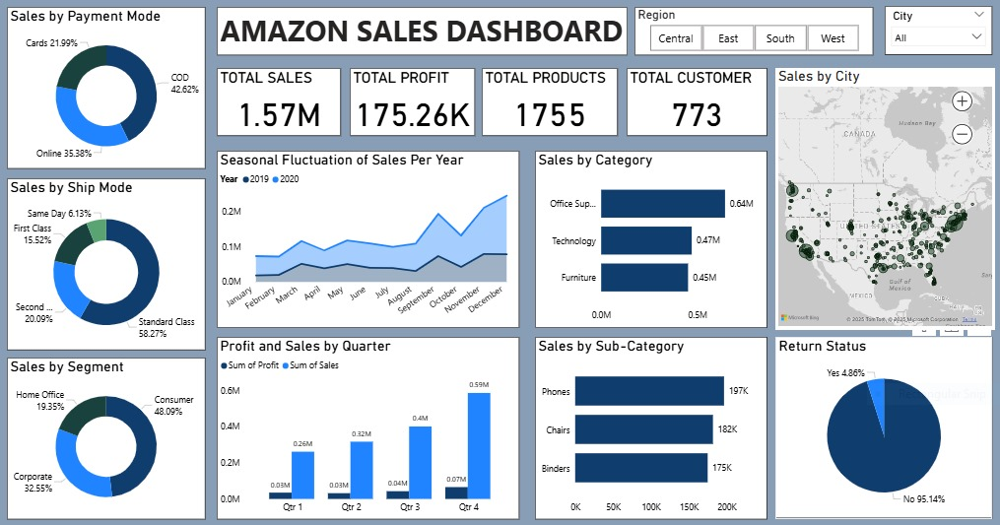

# Amazon Sales Analysis Dashboard
## Project Overview

This project focuses on analyzing Amazon sales data to uncover key business insights related to sales performance, customer behavior, product trends, and profitability.
An interactive dashboard is created to help stakeholders make data-driven decisions.

## Objectives

* Analyze overall sales, profit, and customer trends
* Identify top-performing categories and sub-categories
* Understand customer segments, regions, and payment modes
* Track seasonal sales patterns
* Improve business strategy and revenue growth

## Dataset Description

The dataset contains transactional sales data with the following columns:
* Row ID – Unique row identifier
* Order ID – Unique order identifier
* Order Date – Date when the order was placed
* Ship Date – Date when the order was shipped
* Ship Mode – Shipping method used
* Customer ID – Unique customer identifier
* Customer Name – Name of the customer
* Segment – Customer segment (Consumer, Corporate, Home Office)
* Country – Country of order
* City – City of the customer
* State – State of the customer
* Region – Region of sales
* Product ID – Unique product identifier
* Category – Product category
* Sub-Category – Product sub-category
* Product Name – Name of the product
* Sales – Total sales amount
* Quantity – Quantity sold
* Profit – Profit earned
* Returns – Product return status
* Payment Mode – Mode of payment used

## Dashboard KPIs
* Total Sales: 1.57M
* Total Profit: 175.26K
* Total Products Sold: 1755
* Total Customers: 773

## Key Insights
Sales by Payment Mode
 * Cash on Delivery (COD) is the most used payment method.
 * Online payments and card payments also contribute significantly.

Sales by Ship Mode
 * Standard Class shipping has the highest number of orders.
 * Same Day and First Class shipping are used less frequently.

Sales by Segment
 * Consumer segment contributes the highest sales.
 * Followed by Corporate and Home Office segments.

Sales by Category
 * Office Supplies generate the highest sales.
 * Technology and Furniture follow closely.

Sales by Sub-Category

Top sub-categories:
 * Phones
 * Chairs
 * Binders

Seasonal Sales Trend

 * Sales show a seasonal pattern, peaking towards the end of the year.
 * Q4 has the highest sales and profit.

Regional & City Analysis

 * Sales are concentrated in major cities.
 * Regional filters help analyze performance across Central, East, South, and West regions.

Return Status

Majority of products are not returned, indicating high customer satisfaction.

## Final Conclusion

 * The analysis reveals that Consumer segment customers, using Standard shipping and COD payment mode, contribute most to Amazon’s sales.
 * Office Supplies and Technology products, especially Phones and Chairs, drive high revenue.
 * Sales peak in Q4, making it a crucial period for promotions and inventory planning.

## Business Recommendations

 * Focus marketing campaigns during Q4 for maximum impact
 * Promote high-performing sub-categories like Phones and Chairs
 * Improve delivery efficiency for Standard Class shipping
 * Encourage digital payments with offers and discounts
 * Target high-sales regions and cities with personalized promotions

